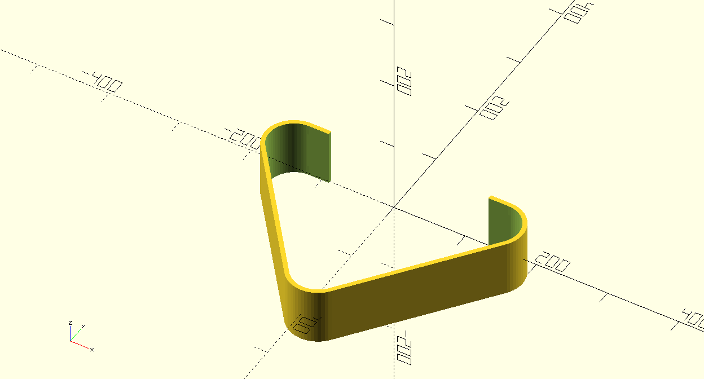

# 🦿 MVP: Sistema Paramétrico de Estabilização Pélvica de Baixo Custo
> Tecnologia Assistiva Aberta em Manufatura Aditiva para Estímulo ao Reflexo de Marcha em Residência Inclusiva.

[](#)
[](#)
[](#)



---

## 📌 Contexto e Problema
Adultos cadeirantes institucionalizados em serviços de acolhimento (como Residências Inclusivas) frequentemente vivenciam quadros severos de imobilismo crônico. Embora muitos indivíduos preservem o reflexo de marcha automática, a falta de alinhamento e ancoragem segura da pelve inviabiliza sua ativação funcional no dia a dia. 

Os dispositivos comerciais convencionais de bipedestação apresentam:
- **Custo proibitivo** para serviços públicos e filantrópicos.
- **Estruturas rígidas e padronizadas**, incompatíveis com deformidades posturais e assimetrias anatômicas severas.
- Alto risco de lesões por pressão (LPP) nas cristas ilíacas e trocânteres.

---

## 💡 A Solução Proposta
Desenvolvimento de uma **órtese híbrida paramétrica de baixo custo**:
1. **Design Digital via Código:** Algoritmo livre (OpenSCAD/Python) que recebe as variáveis anatômicas do residente (largura bi-ilíaca, profundidade sagital e perímetros) e gera instantaneamente a malha tridimensional sob medida (.STL).
2. **Manufatura Aditiva:** Impressão das interfaces de suporte em filamento PETG com preenchimento tipo giroide (alta resistência mecânica e leveza).
3. **Chassi Híbrido Acoplável:** Estrutura metálica leve e de baixo custo, acoplável à cadeira de rodas com acolchoamento técnico protetor (EVA/Neoprene).

---

## 📁 Estrutura do Repositório
```text
mvp_proteses_3d/
├── docs/
│   ├── protocolo_antropometrico.md  # Roteiro de medição das cristas e trocânteres
│   └── orcamento_e_captacao.md      # Metas financeiras detalhadas e custos
├── models/
│   ├── stl/                         # Arquivos 3D compilados para teste
│   └── renders/                     # Vistas conceituais e simulações
├── src/
│   └── pelve_parametrica.scad       # Código-fonte gerador do suporte pélvico
├── LICENSE                          # Licença de código aberto
└── README.md                        # Apresentação do projeto e captação

---
```

## 🤝 Como Apoiar / Metas de Financiamento

Buscamos apoio financeiro, doação de equipamentos ou parcerias técnicas para viabilizar as etapas de fabricação:

| Meta | Objetivo | Valor Estimado |
| :--- | :--- | :--- |
| **Meta 1: Insumos de Prototipagem** | 5 carretéis de Filamento PETG + Cintas, Espumas EVA e Insertos | ~ R$ 650,00 |
| **Meta 2: Kit Antropométrico** | Paquímetro de grandes diâmetros + Fitas técnicas para triagem | ~ R$ 450,00 |
| **Meta 3: Chassi Metálico** | Tubulação leve, dobras de serralharia e manípulos de ajuste | ~ R$ 600,00 |
| **Meta 4: Manufatura Local Dedicada** | Impressora 3D de entrada para a instituição (caso não haja FabLab) | ~ R$ 2.200,00 |

### Formas de Contribuir:
- **Doação direta / Crowdfunding:** [Insira chave Pix institucional, Benfeitoria ou Catarse]
- **Doação de Equipamentos/Filamentos:** Empresas ou makers que possam doar carretéis de PETG ou horas de impressão.
- **Contato Institucional:** [Seu E-mail Profissional / LinkedIn]